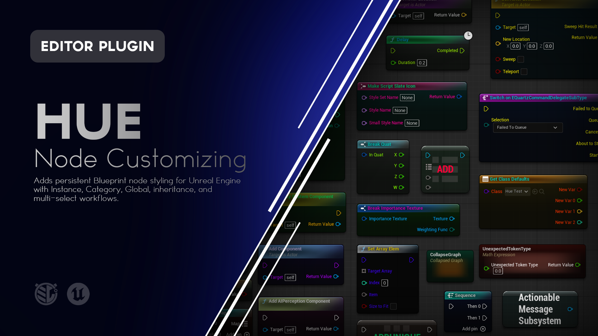

# Hue

**Persistent visual styling for Unreal Engine Blueprint nodes.**

Hue adds editor-only color styling to compatible Blueprint nodes without changing how those Blueprints behave.

Style a single node, an entire user-defined Blueprint Category, or the same logical node throughout the project. Each part of the node can be styled independently, inherited through nested Categories, and overridden exactly where needed.




---

## What is Hue?

Blueprint graphs can become difficult to read long before they become technically complicated.

Execution flow, data flow, comments, reroutes, functions, variables, events, and different gameplay systems can all occupy the same visual space.

Unreal Engine already gives Blueprint nodes a visual language, but there are situations where you want to add another layer of organization.

Hue lets you build that layer yourself.

A project might decide:

```text
Green   = Queries / Read Only
Blue    = Movement
Orange  = Combat
Purple  = UI
Red     = Critical State Changes
```

Or it might use color to distinguish:

```text
Input
Validation
Calculation
State Change
Output
```

Hue lets those visual rules scale beyond manually styling individual nodes.

A style can belong to:

- One specific node
- A Blueprint Category
- A logical node identity across the project

Those layers can inherit from one another, and every visual channel can resolve independently.

---

# Features

### Four Independent Visual Channels

Hue can independently style:

- **Header Color**
- **Header Text Color**
- **Body Color**
- **Body Text Color**

You do not need to replace the entire visual style just to change one part of a node.

### Instance Styling

Apply a style to one specific Blueprint node instance.

### Category Styling

Style Blueprint members based on their user-defined **My Blueprint Category**.

### Global Styling

Style the same logical function, variable, event, macro, operator, or supported node identity throughout the project.

### Nested Category Inheritance

Parent Categories can provide styles to their descendants.

### Per-Channel Inheritance

Header, body, and text colors resolve independently.

A node can inherit three channels while overriding only one.

### Category Rename Persistence

Rename a styled Blueprint Category and Hue migrates its applicable style rules with it.

### Multi-Selection Editing

Select unrelated compatible nodes and style them together in one operation.

### Mixed-Value Reporting

Hue clearly reports when a multi-selection contains:

- Shared values
- Inherited values
- Multiple Values
- Unavailable scopes

### Effective Source Reporting

Hue shows where an inherited value is currently coming from.

Examples include:

```text
Override
Category: Combat|Weapons
Parent: Combat
Global Function
Global Variable
Global Event
Unreal Default
```

### Right-Click Workflow

Hue styling is available directly from compatible Blueprint node context menus.

### Dedicated Blueprint Editor Panel

The Hue panel provides a persistent place to inspect and edit the currently selected node or selection.

### Broad Blueprint Node Coverage

Hue supports the normal K2 node presentation plus many specialized node families.

### Native-Safe Presentation

Specialized native controls remain Unreal-owned.

Hue does not replace a node's important functionality merely to recolor it.

### Undo / Redo

Hue editing participates in Unreal Engine's normal transaction system.

Batch operations use one transaction, allowing the complete change to be undone or redone together.

### Persistent Styling

Instance and Category styles are stored with the relevant Blueprint assets.

Global styles are stored as project configuration.

### Editor Only

Hue adds no gameplay system and has no impact on packaged-game behavior.

---
<!--
> [!IMPORTANT]
> **ATTENTION - README AUTHOR**
>
> Capture the Hue panel here.
>
> **Recommended visual:** Annotated screenshot
>
> Select one compatible Blueprint node and show the complete Hue panel.
>
> Make sure the screenshot clearly includes:
>
> 1. Instance
> 2. Category
> 3. Global scope
> 4. Header Color
> 5. Header Text Color
> 6. Body Color
> 7. Body Text Color
> 8. Current source labels such as Override or Inherited
>
> Use a node that has an applicable Category and Global identity so all three scopes are available.
>
> If possible, give the node a different source for at least two channels so the source reporting is meaningful.
>
> **Suggested file:**
>
> `Doc/Images/Hue-Panel.png`
>
> Once captured, replace this callout with:
>
> ```markdown
> 
> ```
-->
---

# Using Hue

Open a Blueprint Editor and select a compatible node.

Open the **Hue** tab if it is not already visible.

Hue displays the styling controls applicable to the current selection.

The panel is organized into three scopes:

```text
Instance
Category
Global
```

Each scope can independently override:

```text
Header Color
Header Text Color
Body Color
Body Text Color
```

---

# Visual Channels

Hue treats the main visual regions of a Blueprint node independently.

## Header Color

Controls the primary title or header area of the node.

For normal nodes, this is the colored region behind the node title.

For compact nodes that use a single central visual fill, Header Color controls that compact fill.

---

## Header Text Color

Controls the primary node title text.

It also applies to compatible secondary title lines such as:

```text
Target is ...
```

Unreal's native subdued opacity behavior for secondary text remains intact.

---

## Body Color

Controls the primary body tint beneath the node header.

On compact nodes without separate header and body surfaces, Body Color acts as a fallback when Header Color does not provide a Hue override.

---

## Body Text Color

Controls compatible body text presentation, including:

- Pin labels
- Execution-pin triangles
- Other compatible node text

Editable value controls remain Unreal-owned.

For example, Hue does not replace the native styling of:

- Numeric fields
- Checkboxes
- Dropdowns
- Class pickers
- Object pickers

This preserves the interaction and readability of native Blueprint controls.

---
<!--
> [!IMPORTANT]
> **ATTENTION - README AUTHOR**
>
> Capture the four visual channels here.
>
> **Recommended visual:** Screenshot
>
> Use one normal Blueprint node and deliberately exaggerate the four channels so each region is unmistakable.
>
> For example:
>
> - Header Color = Red
> - Header Text Color = White
> - Body Color = Dark Blue
> - Body Text Color = Yellow
>
> Annotate the screenshot with:
>
> 1. Header Color
> 2. Header Text Color
> 3. Body Color
> 4. Body Text Color
>
> This image is instructional rather than aesthetic, so strong contrasting colors are useful.
>
> **Suggested file:**
>
> `Doc/Images/Hue-Channels.png`
>
> Once captured, replace this callout with:
>
> ```markdown
> 
> ```
-->
---

# Styling Scopes

Hue supports three layers of styling:

```text
Instance
Category
Global
```

They resolve in that order.

An Instance override is the most specific.

Global styling is the broadest.

---

# Instance

**Instance** affects only the selected node instance.

For example, imagine several calls to:

```text
Apply Damage
```

throughout a Blueprint.

Changing the Instance Header Color of one call affects only that specific node.

Use Instance styling when something is important because of **where this node is being used**, rather than what the node represents everywhere else.

---

# Category

**Category** applies to compatible Blueprint members belonging to a user-defined **My Blueprint Category**.

This refers to the Categories used to organize things such as:

- Functions
- Macros
- Events
- Variables

inside the Blueprint's **My Blueprint** panel.

It does not refer to Unreal's generic action-menu categories or a node's C++ class.

For example:

```text
Combat
├── Attack
├── ApplyDamage
└── CalculateDamage
```

A Hue Category style on:

```text
Combat
```

can provide styling to nodes associated with those Blueprint members.

---

# Global

**Global** styles the same logical Hue identity throughout the project.

The exact meaning depends on the node.

Examples include:

### Global Function

Styles calls to the same function.

### Global Variable

Styles the same Blueprint member variable.

Variable Get and Variable Set nodes for that member share the same Global Variable identity.

### Global Event

Styles the same event identity.

### Global Macro

Styles uses of the same macro.

### Global Operator

Styles the same promotable operator regardless of its currently promoted numeric type.

### Global Node

Some supported node families use their node type as their Global identity when a more specific identity does not apply.

Global styling is useful when a node should carry the same visual meaning wherever it appears.

---

# Styling Precedence

Hue resolves styles using:

```text
Instance
> Exact Category
> Nearest Parent Category
> Higher Parent Categories
> Global
> Unreal Default
```

The first applicable override wins.

But this happens **independently for each visual channel**.

That distinction is important.

For example:

```text
Global
Header Color = Blue
Body Color = Dark Gray

Category: Combat
Header Color = Red

Instance
Body Text Color = Yellow
```

The final node could resolve to:

```text
Header Color       Red         Category
Header Text Color  Unreal      Unreal Default
Body Color         Dark Gray   Global
Body Text Color    Yellow      Instance
```

Hue does not require the complete style to come from one scope.

---
<!--
> [!IMPORTANT]
> **ATTENTION - README AUTHOR**
>
> This should be one of the primary Hue demonstrations.
>
> **Recommended visual:** GIF
>
> Show one node with a Global style already applied.
>
> Then:
>
> 1. Apply a Category Header Color.
> 2. Show only the Header Color change while other channels remain inherited.
> 3. Apply an Instance Body Color.
> 4. Clear the Instance Body Color.
> 5. Show the lower-precedence value immediately return.
> 6. Clear the Category Header Color.
> 7. Show the Global value return.
>
> Keep the Hue panel visible so the viewer can see the source labels change between:
>
> - Override
> - Category
> - Global
> - Unreal Default
>
> **Suggested file:**
>
> `Doc/Images/Hue-Precedence.gif`
>
> Once captured, replace this callout with:
>
> ```markdown
> 
> ```
-->
---

# Nested Category Inheritance

Hue understands Unreal's nested My Blueprint Category syntax.

For example:

```text
Combat
Combat|Weapons
Combat|Weapons|Melee
```

A style applied to:

```text
Combat
```

can be inherited by:

```text
Combat|Weapons
Combat|Weapons|Melee
```

unless a closer Category overrides that channel.

---

## Example

Imagine:

```text
Combat
    Header Color = Red
    Body Color = Dark Gray

Combat|Weapons
    Header Color = Orange

Combat|Weapons|Melee
    No explicit style
```

A node in:

```text
Combat|Weapons|Melee
```

resolves:

```text
Header Color = Orange
Body Color   = Dark Gray
```

The Header Color comes from the nearest styled parent:

```text
Combat|Weapons
```

The Body Color continues farther upward until it finds:

```text
Combat
```

No values need to be copied into the child Category.

---

# Dynamic Inheritance

Parent values remain live.

If:

```text
Combat
```

provides a Body Color to several descendants, changing Combat's Body Color immediately changes every descendant that does not have a closer override.

Clearing a child override immediately reveals the next available inherited source.

---
<!--
> [!IMPORTANT]
> **ATTENTION - README AUTHOR**
>
> Capture nested Category inheritance here.
>
> **Recommended visual:** GIF
>
> Use a Blueprint with:
>
> ```text
> Combat
> Combat|Weapons
> Combat|Weapons|Melee
> ```
>
> Show nodes representing each Category.
>
> Demonstrate:
>
> 1. Style Combat.
> 2. Show Weapons and Melee inherit.
> 3. Override one channel on Weapons.
> 4. Show Melee inherit that closer value.
> 5. Clear the Weapons override.
> 6. Show the Combat value return.
>
> Keep both the My Blueprint Categories and the graph visible if practical.
>
> **Suggested file:**
>
> `Doc/Images/Hue-Category-Inheritance.gif`
>
> Once captured, replace this callout with:
>
> ```markdown
> 
> ```
-->
---

# Category Rename Persistence

Hue tracks styled Blueprint Categories while a Blueprint is being edited.

If you rename:

```text
Attack
```

to:

```text
Combat
```

Hue migrates the applicable Category style.

Nested styled Categories can migrate with that hierarchy as well.

For example:

```text
Attack
Attack|Weapons
```

can become:

```text
Combat
Combat|Weapons
```

without losing their Hue rules.

---

## Moving a Member Is Not a Category Rename

Moving one function, variable, event, or macro from one Category to another does not move the old Category style.

For example:

```text
Function A
Combat -> Utility
```

does not mean:

```text
Rename Combat to Utility
```

Hue distinguishes between reorganizing individual members and renaming the Category itself.

---

# Effective Source Reporting

Hue tells you where the currently displayed value comes from.

For a selected node, a channel may report:

```text
Override
```

when the current scope explicitly owns the value.

It may instead report:

```text
Category: Combat|Weapons
```

```text
Parent: Combat
```

```text
Global Function
```

```text
Global Variable
```

```text
Global Event
```

```text
Global Macro
```

or:

```text
Unreal Default
```

This makes inheritance visible instead of requiring you to remember which scope currently controls the node.

---

# Clearing Overrides

Each visual channel includes:

**Clear**

Clear removes the explicit value from the current scope.

It does not force the property back to Unreal's default if a lower-precedence Hue rule exists.

Instead, the next available value becomes visible.

For example:

```text
Instance
Header Color = Red

Category
Header Color = Orange

Global
Header Color = Blue
```

Clear Instance:

```text
Header Color = Orange
```

Clear Category:

```text
Header Color = Blue
```

Clear Global:

```text
Header Color = Unreal Default
```

---

# Clear All Overrides

Each scope also provides:

**Clear All Overrides**

This removes all four explicit visual channels from that scope.

Lower-precedence values immediately become visible again.

---

# Multi-Selection

Hue supports batch editing across multiple selected compatible nodes.

The nodes do not need to be:

- The same class
- The same function
- The same Category
- Adjacent in the graph

Select them together and Hue evaluates the applicable targets for each scope.

---

## Instance Batch Editing

Instance edits apply to every compatible selected node instance.

For example:

```text
8 Hue-compatible nodes selected
```

Setting Instance Body Color applies that Body Color to all eight nodes in one transaction.

---

## Category Batch Editing

Category edits operate on the unique Categories represented by the current selection.

For example, selecting nodes from:

```text
Combat
Combat
Movement
Movement
UI
```

represents:

```text
3 unique Category targets
```

Hue edits those three Categories rather than redundantly writing the same Category several times.

Nodes without an applicable My Blueprint Category remain selected but are ignored by that scope.

---

## Global Batch Editing

Global edits operate on unique logical Hue identities.

For example, selecting several calls to the same function still represents one Global Function target.

Hue deduplicates repeated identities before applying the batch.

---

# Multiple Values

When selected targets do not share the same state, Hue reports:

**Multiple Values**

This can mean:

- Different explicit colors
- Different inherited colors
- Some targets explicitly override the channel while others inherit it

Even if two nodes happen to look the same, Hue can still report Multiple Values when the underlying ownership differs.

Choosing a new color replaces that channel across all applicable scope targets.

---

## Unsupported Nodes in a Selection

Unsupported nodes can remain selected.

Hue reports how many selected nodes are unsupported and leaves them unchanged.

Supported nodes continue to participate in the batch edit.

This allows Hue to remain conservative without forcing you to constantly rebuild selections around unsupported nodes.

---
<!--
> [!IMPORTANT]
> **ATTENTION - README AUTHOR**
>
> Capture multi-selection editing here.
>
> **Recommended visual:** GIF
>
> Select several visibly different node types.
>
> Include at least one unsupported node if convenient.
>
> Show:
>
> 1. The Hue panel reporting the compatible selected-node count.
> 2. A channel displaying Multiple Values.
> 3. Apply one Body Color across the Instance scope.
> 4. Undo once.
> 5. Show the complete batch revert together.
>
> If the selection represents several Categories or Global identities, briefly expand those sections so the unique-target counts are visible.
>
> **Suggested file:**
>
> `Doc/Images/Hue-Multi-Selection.gif`
>
> Once captured, replace this callout with:
>
> ```markdown
> 
> ```
-->
---

# Right-Click Workflow

Compatible nodes also expose:

**Right-click > Hue**

The Hue submenu provides access to the same major styling scopes without requiring the Hue panel to remain open.

Depending on the selected node, available sections can include:

- Instance
- Category
- Global Function
- Global Variable
- Global Event
- Global Macro
- Global Operator
- Global Node

If the node you right-click is part of the current compatible multi-selection, Hue can apply the operation to that selection as a batch.

---
<!--
> [!IMPORTANT]
> **ATTENTION - README AUTHOR**
>
> Capture the right-click Hue submenu here.
>
> **Recommended visual:** Screenshot
>
> Right-click a node that supports all three major scope levels.
>
> Show:
>
> - Hue submenu
> - Instance
> - Category
> - Applicable Global scope
>
> This image is optional if the Hue panel and precedence GIF already communicate the workflow clearly.
>
> **Suggested file:**
>
> `Doc/Images/Hue-Context-Menu.png`
>
> Once captured, replace this callout with:
>
> ```markdown
> 
> ```
-->
---

# Supported Node Coverage

Hue supports the normal K2 node presentation and a broad range of specialized Blueprint node families.

Current coverage includes:

- Standard function calls
- Pure function calls
- Impure function calls
- Blueprint Events
- Variable Get
- Variable Set
- Cast nodes
- Latent calls such as Delay
- Compatible async-task nodes
- Compact operators
- Conversion nodes
- Sequence
- Select
- MultiGate
- Make Array
- Make Set
- Make Map
- Switch nodes
- Timeline
- Format Text
- Collapsed Graph nodes
- Composite nodes
- Construct Object from Class
- Add Component by Class
- Create Widget
- Spawn Actor
- Spawn Actor from Class
- Create Event
- Create Delegate
- Material Parameter Collection function nodes
- Make Struct presentations
- Compatible Copy nodes

Hue also supports many normal K2 nodes through its general K2 presentation path rather than requiring every individual node class to be hardcoded.

---

# Native-Safe Specialized Nodes

Some Blueprint nodes have specialized interfaces that do more than draw a normal title and body.

Examples include nodes containing:

- Class selectors
- Dynamic pins
- Add Pin controls
- Exposed-on-spawn properties
- Specialized dropdowns
- Node-specific editing controls

Hue preserves those native interactions.

For compatible specialized presentations, Unreal continues to create and control the native node interface while Hue attaches only to visual surfaces it can safely identify.

If Hue cannot confirm that a presentation can be styled safely, it leaves that presentation alone.

---

# Intentionally Unsupported Nodes

## Reroute Nodes

Reroute nodes do not contain meaningful Header and Body surfaces that map to Hue's four visual channels.

Hue therefore does not expose styling controls for them.

## Documentation Nodes

Blueprint Documentation nodes use a specialized presentation that Hue intentionally leaves unchanged in 1.0.0.

## Unsupported Custom Presentations

A custom K2 node may work automatically when its displayed widget exposes compatible standard graph surfaces.

If Hue cannot identify a safe styling path, it leaves the node untouched rather than exposing controls that appear to work but do not actually affect the presentation.

---

# Saving Hue Styles

Hue uses different storage depending on the scope.

## Instance Styles

Stored with the Blueprint asset that owns the node.

## Category Styles

Stored with the Blueprint that defines those members.

## Global Styles

Stored in the project's Hue editor configuration.

This allows project-wide Hue identities to remain separate from any one Blueprint asset.

After changing Instance or Category styles, save the affected Blueprint using your normal Unreal workflow.

---

# Team Projects

Hue styling can be shared through your normal source-control workflow.

Instance and Category changes travel with the affected Blueprint assets.

Project-wide Global styles travel through the project's Hue configuration.

Hue does not provide its own:

- Source control
- Check-out system
- Permission system
- Conflict resolution

It stores the visual organization while your existing project workflow distributes it.

---

# Example Workflow

Imagine a Blueprint with Categories:

```text
Movement
Combat
Combat|Weapons
Combat|Damage
UI
```

You decide on a project-wide visual language:

```text
Movement = Blue
Combat = Red
UI = Purple
```

You could:

1. Apply a Blue Category Header Color to `Movement`.
2. Apply a Red Category Header Color to `Combat`.
3. Let `Combat|Weapons` and `Combat|Damage` inherit Red.
4. Give `Combat|Damage` a darker Body Color without replacing the inherited Header Color.
5. Apply a Purple Category style to `UI`.
6. Give `Apply Damage` a Global Function style so every use remains recognizable throughout the project.
7. Give one especially important Apply Damage node an Instance override.
8. Clear that Instance override later and immediately return to the inherited style.

The Blueprint's logic remains unchanged.

Hue adds a visual language on top of it.

---

# Installation

Hue can be installed through **Fab**, from a **GitHub Release**, or directly from the **GitHub source**.

For most users, the Fab or GitHub Release installation is recommended.

---

## Fab / Epic Games Launcher

1. Add **Hue** to your library on Fab.
2. Open the **Epic Games Launcher**.
3. Navigate to your Unreal Engine Library.
4. Locate Hue in your Fab / Vault library.
5. Install Hue to the supported Unreal Engine version.
6. Launch your Unreal Engine project.
7. Open **Edit > Plugins**.
8. Search for **Hue**.
9. Enable the plugin if it is not already enabled.
10. Restart Unreal Editor if prompted.

Once enabled, open a Blueprint Editor and select a compatible node.

---

## GitHub Release

### 1. Download Hue

Open the repository's **Releases** page:

https://github.com/mippi-the-dork/Hue/releases

Download the packaged plugin matching your Unreal Engine version and platform.

For example:

```text
Hue-v1.0.0-UE5.8.3-Win64.zip
```

Do not use GitHub's automatically generated **Source code** ZIP as a precompiled plugin package.

### 2. Close Unreal Editor

Close the project before installing the plugin.

### 3. Locate Your Project Plugins Folder

Your project should contain a `Plugins` directory beside the `.uproject` file:

```text
YourProject/
├── Config/
├── Content/
├── Plugins/
└── YourProject.uproject
```

If `Plugins` does not exist, create it.

### 4. Extract Hue

Extract the `Hue` folder into:

```text
YourProject/Plugins/
```

The final structure should look similar to:

```text
YourProject/
├── Plugins/
│   └── Hue/
│       ├── Config/
│       ├── Doc/
│       ├── Resources/
│       ├── Source/
│       └── Hue.uplugin
└── YourProject.uproject
```

### 5. Launch the Project

Open Unreal Engine.

If necessary:

**Edit > Plugins**

Search for:

```text
Hue
```

Enable it and restart the Editor if prompted.

---

## GitHub Source

Developers who want the source or want to modify Hue can clone the repository directly.

### Requirements

Building Hue from source requires a working Unreal Engine C++ development environment.

For Windows this generally means:

- Unreal Engine 5.8.x
- Visual Studio with the appropriate C++ workloads
- A project capable of compiling C++ plugins

### Clone the Repository

Close Unreal Editor and navigate to your project's `Plugins` directory.

```bash
cd YourProject/Plugins
git clone https://github.com/mippi-the-dork/Hue.git
```

Your project should now contain:

```text
YourProject/Plugins/Hue/
```

### Generate Project Files

If necessary:

1. Right-click the `.uproject`.
2. Select **Generate Visual Studio project files**.
3. Open the generated solution.
4. Build the project's Editor target.

Typical configuration:

```text
Development Editor
Win64
```

Launch the project after compilation completes.

---

# Updating Hue

## GitHub Release Installation

When updating a manually installed release:

1. Close Unreal Editor.
2. Remove the existing `Plugins/Hue` folder.
3. Extract the new Hue release into the `Plugins` directory.
4. Reopen the project.

Replacing the complete plugin folder is recommended rather than copying new files over an older installation.

Hue styling stored in Blueprint assets or project configuration is separate from the installed plugin directory.

---

## Git Source Installation

If Hue was cloned using Git:

```bash
cd YourProject/Plugins/Hue
git pull
```

Rebuild the project if the source changed.

---

# Compatibility

The current Hue release targets:

| | |
|---|---|
| **Hue Version** | 1.0.0 |
| **Unreal Engine** | 5.8.0 - 5.8.3 |
| **Primary Validation Version** | 5.8.3 |
| **Platform** | Windows 64-bit |
| **Plugin Type** | Editor Only |
| **Runtime Dependency** | None |
| **Packaged Game Impact** | None |
| **Engine Source Changes** | None |

Hue uses Unreal Engine 5.8.0 as its compatibility baseline and has been validated through Unreal Engine 5.8.3.

Compatibility with additional engine versions or platforms should not be assumed unless explicitly listed in a later release.

---

# How Hue Works

Hue stores presentation data separately from Blueprint execution behavior.

At a high level:

1. Hue identifies a compatible Blueprint node.
2. It determines which Instance, Category, and Global identities apply.
3. Each of the four visual channels resolves independently through Hue's precedence chain.
4. Hue applies those values to a compatible Slate presentation.
5. Unreal continues to own the node's Blueprint behavior and native controls.
6. Unsupported presentations remain untouched.

Hue's effective resolution order is:

```text
Instance
> Exact Category
> Nearest Parent Category
> Higher Parent Categories
> Global
> Unreal Default
```

Instance and Category data live with Blueprint assets.

Global styling is project configuration.

Category rename migration is handled in response to Blueprint structural changes rather than being recalculated during normal graph drawing.

---

# What Hue Does Not Do

Hue is a **Blueprint Editor presentation tool**.

It does not:

- Change Blueprint execution
- Change Blueprint data flow
- Change Blueprint compilation behavior
- Add runtime gameplay systems
- Affect packaged-game rendering
- Modify Unreal Engine source
- Replace native editable node controls
- Force unsupported nodes through a generic visual replacement
- Treat action-menu Categories as My Blueprint Categories
- Treat C++ node classes as My Blueprint Categories
- Modify node logic because its visual style changed

Hue changes how compatible nodes communicate visually.

It does not change what those nodes do.

---

# Limitations

### Supported Presentations

Hue requires a compatible visual path.

A node can be logically valid Blueprint content while still using a presentation Hue cannot safely style.

Those nodes remain native.

### Editable Controls

Controls such as:

- Numeric fields
- Checkboxes
- Dropdowns
- Class pickers
- Object pickers

remain Unreal-owned and do not automatically inherit Hue Body Text Color.

### Reroute Nodes

Reroute nodes are intentionally unsupported.

### Documentation Nodes

Documentation nodes are intentionally unsupported in Hue 1.0.0.

### Category Scope

Category styling applies to applicable user-defined **My Blueprint Categories**.

Not every graph node has a Category identity.

When Category does not apply, the Hue panel reports the scope as unavailable.

### Global Identity

Global does not simply mean "every node with the same visible title."

Hue uses a logical identity appropriate to the node family.

### Editor Only

Hue's visual styling exists only inside Unreal Editor.

It does not become part of the packaged game's rendering.

---

# Troubleshooting

## The Hue Panel Is Missing

Check:

**Edit > Plugins**

Search for:

```text
Hue
```

Confirm the plugin is enabled.

Restart Unreal Editor if it was just enabled.

Then reopen the Blueprint Editor and open the **Hue** tab from its available tabs if necessary.

---

## Hue Says the Selected Node Is Unsupported

Hue only enables editing when it has confirmed a compatible visual presentation.

The node may use a specialized interface that Hue intentionally leaves native.

Unsupported nodes are not modified.

---

## Category Is Unavailable

Category styling requires the node to resolve to an applicable user-defined My Blueprint Category.

Make sure the underlying Blueprint function, variable, event, macro, or other applicable member has a Category assigned in **My Blueprint**.

---

## Clearing a Color Did Not Return to Unreal's Default

The channel may still inherit a value from a lower-precedence Hue scope.

Remember:

```text
Instance
> Category
> Global
> Unreal Default
```

Check the source label beside the channel to see where the current value is coming from.

---

## A Child Category Changed When I Edited Its Parent

This is expected when the child does not override that channel.

Nested Category styling is inherited dynamically.

Give the child its own override if it needs to differ from its parent.

---

## Renaming a Category Changed Several Styled Categories

Renaming a parent Category can also rename nested Category paths.

Hue migrates applicable descendant rules so they continue following the renamed hierarchy.

---

## Moving One Member Did Not Move the Category Style

This is intentional.

Moving an individual Blueprint member to another Category is not treated as renaming the original Category.

---

## Variable Get and Set Changed Together Globally

This is expected.

Global Variable styling represents the underlying Blueprint member variable, so compatible Get and Set nodes share that Global Variable identity.

---

## A Multi-Selection Shows Multiple Values Even Though the Nodes Look the Same

The visible colors may match while their ownership differs.

For example:

- One node may explicitly override a channel.
- Another may inherit the same visible color.

Hue reports **Multiple Values** because their underlying style state is different.

---

# Reporting Bugs

If you encounter a problem, please open an issue:

https://github.com/mippi-the-dork/Hue/issues

When reporting a bug, include:

- Hue version
- Unreal Engine version
- Windows version
- Whether Hue was installed from Fab, a GitHub Release, or source
- Exact Blueprint node type
- Whether the issue affects Instance, Category, or Global styling
- Which visual channel is affected
- Whether the node uses a specialized interface
- Whether single-selection or multi-selection was involved
- Steps to reproduce the problem
- Screenshots or video when relevant
- Relevant Unreal Editor log output

For rendering problems, include a screenshot of the complete affected node rather than only the incorrectly colored area.

---

# Feature Requests

Suggestions and feature requests are welcome through GitHub Issues.

When proposing a feature, describe the Blueprint organization or readability problem you're trying to solve rather than only the implementation you would like to see.

Hue is intended to support visually meaningful Blueprint nodes wherever that styling can be added without compromising their native behavior.

---

# Contributions

Pull requests are welcome.

If you're considering a significant change, opening an Issue first is recommended so the intended behavior can be discussed before substantial work is done.

Hue is intended to remain focused on Blueprint graph styling and visual organization.

---

# License

Hue is distributed under the **MIT License**.

See [`LICENSE`](LICENSE) for details.

---

# About

Hue is an Unreal Engine editor utility created by **Mippi the Dork**.

The plugin was built around a simple idea:

> Blueprint color should be able to communicate structure, meaning, and intent instead of being limited to individual nodes.

Hue turns node styling into a visual language that can scale with the Blueprint.
